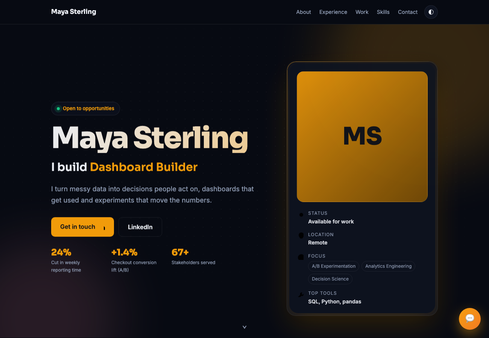
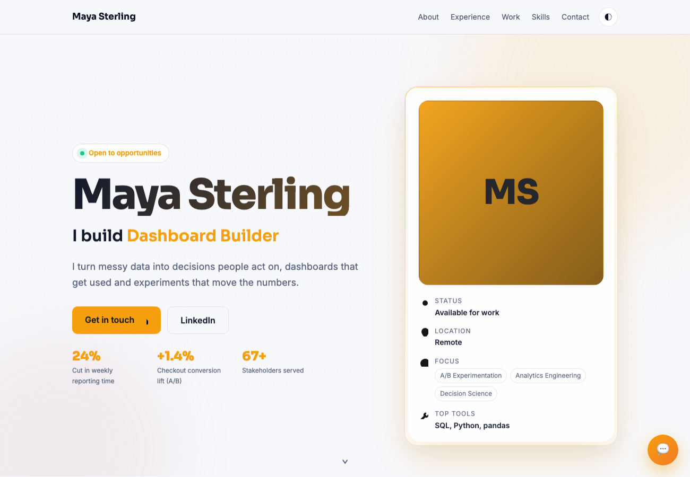
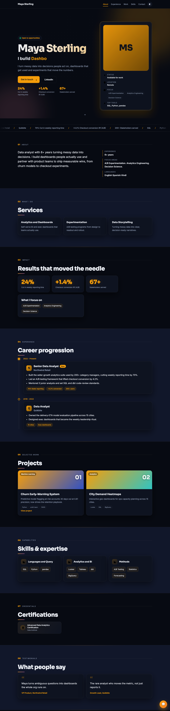
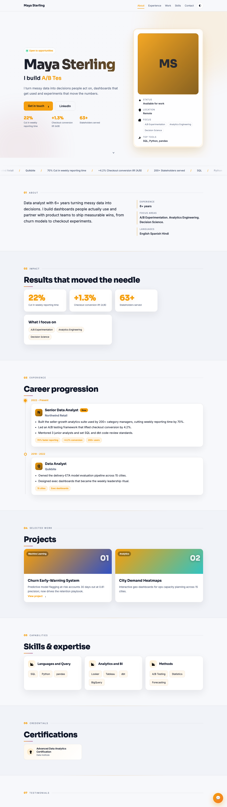
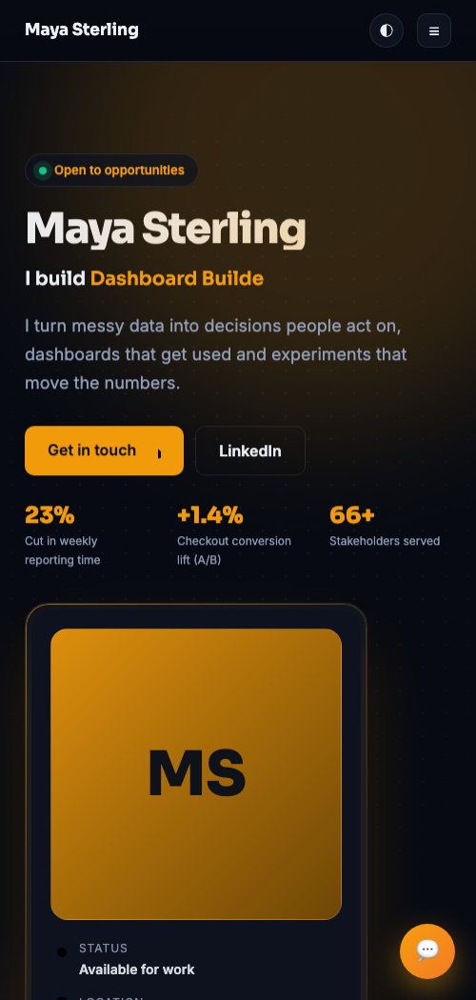
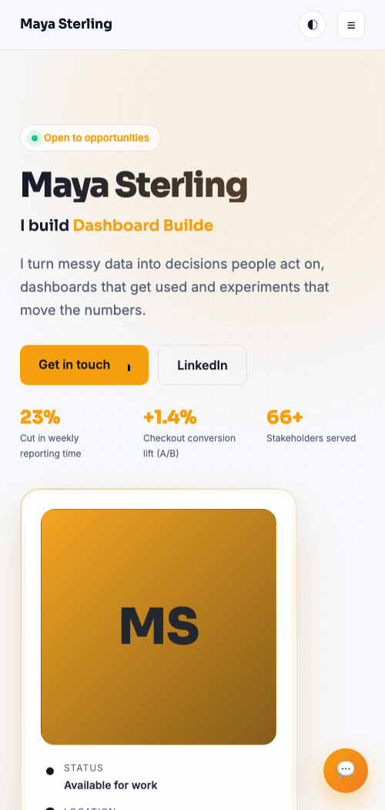

# Portfolio Pro

Turn **any resume into a premium portfolio website** with no coding. Drop a resume in a folder, run the
plugin, and get a polished, single file site (light or dark, your accent color) with a built in chatbot,
ready to deploy free to GitHub Pages.

A Claude Code plugin. Built for the *Claude for Everyone* workshop.

## Preview

Hero, dark and light:

| Dark | Light |
| --- | --- |
|  |  |

Full page, dark and light:

| Dark | Light |
| --- | --- |
|  |  |

Mobile, dark and light:

 

*(Demo uses a fictional person, "Maya Sterling", and fictional companies.)*

## How it works (deterministic by design)

The design lives in fixed plugin code. The agent only does two things:

1. extracts your resume into a `resume.json`
2. runs `build.py`

Same code plus your data produces identical output every time. No regenerated design.

```
resume.pdf / linkedin.pdf  ->  resume.json  ->  build.py  ->  index.html  ->  GitHub Pages
```

## The "Aurora" design includes

* Loading splash, two column hero (photo or monogram, quick facts, typewriter role, teaser stats, cursor spotlight)
* Credibility marquee and a bento impact grid with animated count up
* Vertical career timeline (company marks, metric chips, "Now" badge, drawn rail)
* Icon category skills, gradient or image project cards, credential badges
* Education, awards, languages, testimonials, contact
* A client side chatbot that answers from your resume (no backend, no API key)
* Scroll spy nav, mobile menu, light or dark, any accent color, favicon and Open Graph
* One self contained `index.html`, zero runtime dependencies

## Install (in Claude Code)

Run these as **two separate messages**:

```
/plugin marketplace add https://github.com/fnusatvik07/portfolio-pro-plugin
```

```
/plugin install portfolio-pro@claude4everyone
```

Use the HTTPS URL. `portfolio-pro` is the plugin name and `claude4everyone` is the marketplace name.

## Use it

1. Make a folder and drop your **resume** in it (`resume.pdf`; PDF, DOCX or TXT all work). Optionally add
   a LinkedIn "Save to PDF" export and it gets merged in.
2. Run `/portfolio` (or say "use the portfolio-builder skill with the resume in this folder").
3. Confirm the extracted details, then pick your look (prompted):
   - **Theme:** light, dark, or auto (follows the visitor's system)
   - **Accent color:** a preset (amber, sky, violet, emerald, rose, indigo, teal, slate, ...), any `#hex`, or `auto` (matches your photo)
   - **Font:** default (modern), serif (editorial), or grotesk
4. It builds `index.html` and opens it. When ready, say "deploy this to GitHub Pages" and it
   **automatically** creates the repo, pushes, enables Pages, and returns your **live URL**.

## Photos
A headshot is found automatically, in this order: an image embedded in the PDF, then your public
GitHub avatar, then Gravatar (from your email), then any `photo.jpg` you drop in the folder. If none is
found, a clean monogram is used. (LinkedIn is never scraped: it is login-gated and against its terms.)

## Deploy (automated)
Say "deploy". The first time, you authenticate once with `gh auth login` (stored securely and reused), or
provide a Personal Access Token with `repo` scope as `GH_TOKEN`. After that, deploys are one step and you
get a `https://<you>.github.io/<repo>/` link. (Manual fallback: Netlify Drop.)

## Requirements

* `python3` for `build.py` (no third party packages needed)
* `markitdown` for reading PDF and DOCX: `pip install "markitdown[all]"` (installed on first run if missing)
* Optional, only if you want to auto-extract a headshot from a PDF (for example a LinkedIn "Save to PDF" export): `pip install pymupdf`
* Optional, only for the `auto` accent ("match my photo"): `pip install pillow`
* Optional, only for automated deploy: GitHub CLI (`gh`) or a Personal Access Token with `repo` scope

## Restyle without regenerating

Do not edit the HTML. Rerun `build.py` with a different `--theme` or `--accent`, or tweak `resume.json`.

## License

MIT
